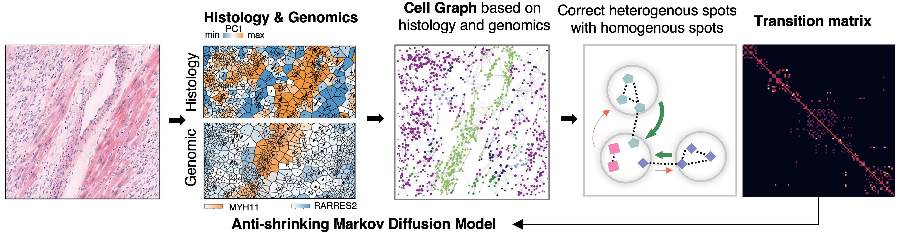
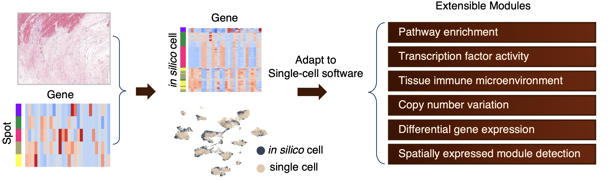

Thor - integrated analysis platform of tissue histology and spatial transcriptomics
========================================================

**Thor** infers single-cell resolution spatial transcriptome through an anti-shrinking Markov diffusion method. 

- Thor leverages both histological and transcriptomic information to achieve single-cell resolution
- Thor does not need additional single-cell data for cell deconvolution within tissue spots

Thor's key modules
========================================================

Visit `Thor Website <www.github.com>`_ [*will be launched soon*] for APIs and tutorials.

What's new
========================================================
- Thor now supports Visium HD data 
- Thor now includes COMMOT for the cell-cell communication analysis

Installation
========================================================
Thor is a Python-based tool designed for data analysis. Installation requires Python version 3.9+. The installation steps below have been tested on MacOS and Linux.

The source code of Thor is available at https://github.com/GuangyuWangLab2021/Thor.

Step 1: Create a Virtual Environment (Optional but Recommended)

- Using `conda <https://docs.conda.io/en/latest/>`_ , you can create a new environment named "Thor" with Python version 3.9 or later: 

  ``conda create -n Thor python=3.9``

- Activate the newly created environment: 

  ``conda activate Thor``

Step 2: Clone Thor Repository

- Thor's source code is hosted on GitHub. To get started, download or clone the Thor repository to your local machine using the following command: 

  ``git clone https://github.com/GuangyuWangLab2021/Thor.git``

- Navigate to the Thor directory: 

  ``cd Thor``

Step 3: Install Thor

- With your virtual environment activated, install Thor using pip. 

  ``pip install .``

- If you would like to perform advanced analyses and visualization.

  ``pip install ".[vis, analysis]"``

**Currently the cell-cell communication module only includes COMMOT, a SOTA model for spatial data. The module is under active development due to the potential limitation of read coverage in single-cell spatial transcriptomics data. We are welcome for any suggestions and feedbacks.** 

To install COMMOT for cell-cell communication analysis, please follow the instructions: 
  
  - It requires R. Version 4.2.2 has been tested.

  - For Python dependencies,

  ``pip install --no-deps commot@git+https://github.com/biopzhang/COMMOT.git``
  
  ``pip install karateclub@git+https://github.com/benedekrozemberczki/karateclub.git POT libpysal rpy2==3.5.11 anndata2ri==1.2``

Frequently asked questions
==========================

Support
=======
Please send bug reports and suggestions to our GitHub issue page!
